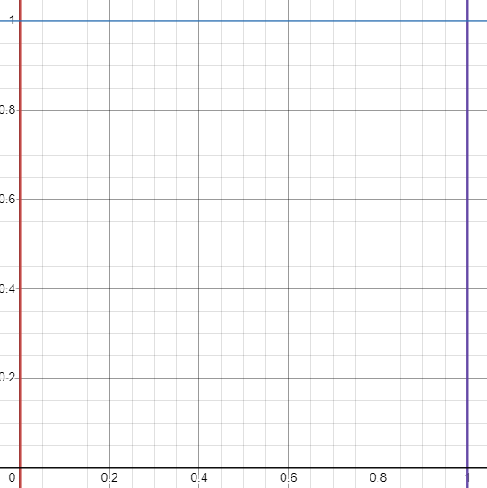
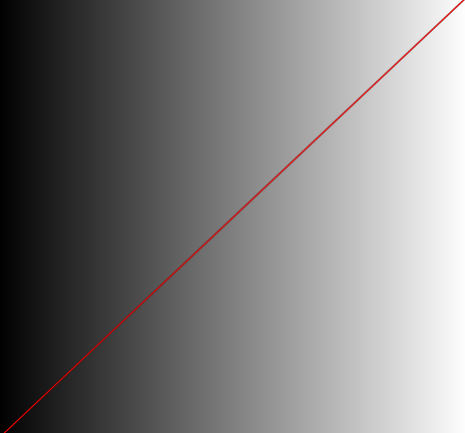

# Lecture2 Draw Functions

> Adapted from https://thebookofshaders.com/05/
## Normalize UV Coordinates

In the beginning of the `main()` function. We usually **normalize** the our uv coordination:



```glsl
// normalization
vec2 uv = gl_FragCoord.xy/u_resolution;
```
- This actually normalize our `uv.x` and `uv.y` $ \in [0, 1]$, which is easy for calculation
    - `uv.x` is the horizontal part
    - `uv.y` is the vertical part 
- The normalization is essentially the last step of **view transformation** in computer graphics' rasterization

## Basic Function

We are going to visualize the normalized value of the x coordinate `uv.x` in two ways
1. **Brightness**: observe the gradient from black to white
2. **Line**: Plot a red line

If you want the result to be distinctive, make sure the range of the `func` variable $\in [0, 1]$

### Plot the Brightness
Plot the brightness is farily simple. Just use the color to represent the `func`.
```glsl
// Plot y changed base on x
vec3 color_bright = vec3(func);
```

### Plot the Function Line
```glsl
/*
uv: normalized uv map
fun: explicit function (line)
output
 1: this part is in the range of the function
 0: this part is not in the range of the function
*/
float plot_func(vec2 uv, float func) {
    float blur = 2./u_resolution.y;    
    return smoothstep(func-blur, func, uv.y) 
    - smoothstep(func, func+blur, uv.y);
}
```
- Notice that, this function is really just subtracting a smaller part from a larger part. It is suitable only for explicit functions, not for implicit or parametric functions.

### Script

```glsl

#ifdef GL_ES
precision mediump float;
#endif

uniform vec2 u_resolution;
uniform vec2 u_mouse;
uniform float u_time;

/*
uv: uv map
fun: function
output 1 to represent there this is in the range of the function, else output 0
*/
float plot_func(vec2 uv, float func) {
    // blur amount is relative to the resolution
    float blur = 2./u_resolution.y;    
    return  smoothstep( func-blur, func, uv.y) -
          smoothstep( func, func+blur, uv.y);
}

void main() {
    // normalization
    vec2 uv = gl_FragCoord.xy/u_resolution;

    // extract the x variable
    float x = uv.x;
    float y = uv.y;

    // try different functions!
    /////////////////////////////////////////////////////////
    float func = x ;
    // func = x*x;
    // func = pow(x,5.0);
    // func = smoothstep(0.1,0.9,x);
    // func = smoothstep(0.2,0.5,x) - smoothstep(0.5,0.8,x);
    // func = sin(15.*x)/2.+.5;
    // func = mod(x, .5);
    // func = fract(3.*x);
    // func = ceil(x);
    // func = floor(x);
    // func = sign(x*2.-1.);
    // func = abs(2.*(x-.5));
    // func = clamp(x*x*2., 0., 1.);
    // func = min(0., x);
    // func = max(0., x);
    /////////////////////////////////////////////////////////

    // Plot a line
    float c_func = plot_func(uv, func);
    vec3 color_func = vec3(c_func) * vec3(1.0,0.0,0.0);

    // Plot y changed base on x
    vec3 color_bright = vec3(func);

    // here we mix the color_bright and color_func
    vec3 color = mix(color_bright, color_func, c_func);
    gl_FragColor = vec4(color,1.0);
}

```
The result looks like this. 
You can uncomment different function to see what different functions look like.


## Common Functions
### Step & SmoothStep
### Sin & Cos
### Extra Functions

## Advanced Shaping Functions

### Polynomial Shaping Functions
> https://www.flong.com/archive/texts/code/shapers_poly/


This section presents a collection of polynomial functions for shaping, tweening, and easing signals in the range $[0,1]$. Functions include:

#### Blinn-Wyvill Approximation to the Raised Inverted Cosine

·

$$y = \frac{4}{9}x^2-\frac{17}{9}x^4+\frac{22}{9}x^2$$

```glsl
float blinnWyvillCosineApproximation(float x){
    float x2 = x*x;
    float x4 = x2*x2;
    float x6 = x4*x2;
    float fa = ( 4.0/9.0);
    float fb = (17.0/9.0);
    float fc = (22.0/9.0);
    float y = fa*x6 - fb*x4 + fc*x2;
    return y;
}
```

**Trigonometric functions** like `cos()` and `sin()` are ubiquitous in natural sciences, engineering and animation, but they can be **expensive** to compute. 

If a situation calls for millions of trigonometric operations per second, substantial speed optimizations can be obtained by using an approximation constructed from simple arithmetic functions. 

An example is the Blinn-Wyvill polynomial approximation to the Raised Inverted Cosine, which diverges from the authentic (scaled) trigonometric function by less than 0.1% within the range $[0,1]$. 

It also shares some of the Raised Inverted Cosine's key properties, having flat derivatives at $0$ and $1$, and the value $0.5$ at $x=0.5$. 

It has the strong advantage that **it is relatively efficient to compute**, since it is comprised exclusively from simple arithmetic operations and cacheable fractions.

Unlike the Raised Inverted Cosine, it does not have infinite derivatives, but since it is a sixth-order function, this limitation is unlikely to be noticed in practice.

#### Exponential Shaping Functions
This seat-shaped function is formed by joining two 3rd-order polynomial (cubic) curves. The curves meet with a horizontal inflection point at the control coordinate $(a,b)$ in the unit square.

 
$$
\begin{aligned}
& x \leq a: y=b-b\left(1-\frac{x}{a}\right)^3 \\
& x>a: y=b+(1-b)\left(\frac{x-a}{1-a}\right)^3
\end{aligned}
$$

```glsl
float doubleCubicSeat(float x, vec2 pos){
    float epsilon = 0.00001;
    float min_param_a = 0.0 + epsilon;
    float max_param_a = 1.0 - epsilon;
    float min_param_b = 0.0;
    float max_param_b = 1.0;
    float a = pos.x;
    float b = pos.y;
    a = min(max_param_a, max(min_param_a, a));  
    b = min(max_param_b, max(min_param_b, b)); 

    float y = 0.;
    if (x <= a){
        y = b - b*pow(1.0-x/a, 3.0);
    } else {
        y = b + (1.0-b)*pow((x-a)/(1.0-a), 3.0);
    }
    return y;
}
```

#### Double-Cubic Seat with Linear Blend
This modified version of the Double-Cubic Seat function uses 

- $a$: a single variable to control the location of its inflection point along the diagonal of the unit square
- $b$: a second parameter is used to **blend this curve with the Identity Function** ($y=x$). Here, we use the variable b to control the amount of this blend, which has the effect of tilting the slope of the curve's plateau in the vicinity of its inflection point. 

The adjustable flattening around the inflection point makes this a useful shaping function for lensing or magnifying evenly-spaced data.

 
$$
\begin{aligned}
& x \leq a: y=b x+(1-b)(a)\left(1-\left(1-\frac{x}{a}\right)^3\right) \\
& x>a: y=b x+(1-b)\left(a+(1-a)\left(\frac{x-a}{1-a}\right)^3\right)
\end{aligned}
$$

```glsl
float doubleCubicSeatWithLinearBlend (float x, float a, float b){
  	float epsilon = 0.00001;
  	float min_param_a = 0.0 + epsilon;
  	float max_param_a = 1.0 - epsilon;
  	float min_param_b = 0.0;
  	float max_param_b = 1.0;
  	a = min(max_param_a, max(min_param_a, a));  
  	b = min(max_param_b, max(min_param_b, b)); 
  	b = 1.0 - b; //reverse for intelligibility.
  
  	float y = 0.;
  	if (x<=a){
    	y = b*x + (1.-b)*a*(1.-pow(1.-x/a, 3.0));
  	} else {
    	y = b*x + (1.-b)*(a + (1.-a)*pow((x-a)/(1.-a), 3.0));
  	}
  	return y;
}
```

#### Double-Odd-Polynomial Seat

The previous *Double-Cubic Seat* function can be generalized to a form which uses *any* odd integer exponent. In the code below, the parameter *n* controls **the flatness or breadth of the plateau region in the vicinity of the point** $(a,b)$. 

- A good working range for *n* is the set of whole numbers from 1 to about 20.

	

```glsl
float doubleOddPolynomialSeat (float x, float a, float b, float n){
  	float epsilon = 0.00001;
  	float min_param_a = 0.0 + epsilon;
  	float max_param_a = 1.0 - epsilon;
  	float min_param_b = 0.0;
  	float max_param_b = 1.0;
  	a = min(max_param_a, max(min_param_a, a));  
  	b = min(max_param_b, max(min_param_b, b)); 

  	float p = 2.*n + 1.;
  	float y = 0.;
  	if (x <= a){
    	y = b - b*pow(1.-x/a, p);
  	} else {
    	y = b + (1.-b)*pow((x-a)/(1.-a), p);
  	}
  	return y;
}
```

#### Symmetric Double-Polynomial Sigmoids

It is possible to generate sigmoid patterns by joining a **symmetric pair of polynomials** at the center of the unit square. 

The exponents in these equations (controlled by the integer parameter *n*) control the steepness of the wall separating the squelched values from the boosted ones

- a suggested range for the whole number n is from 1 to about 10. 

Of these, the sigmoid created with a 2nd-order (quadratic) exponent comes closest to the *Raised Inverted Cosine*, approximating it to within 2.8%.

	

The Symmetric Double-Polynomial Sigmoids presented here create an **S-shape** with

- flat tangents at 0 and 1
- the special property that f(0.5) = 0.5

Sigmoids generated with **even** exponents require the following equations


$$
\begin{aligned}
& x \leq 0.5: y=\frac{2x^{2n}}{2} \\
& x > 0.5: y=1-\frac{(2x-2)^{2n}}{2}
\end{aligned}
$$


**Odd** exponents require a slightly different pair of equations

$$
\begin{aligned}
& x \leq 0.5: y=\frac{2x^{2n+1}}{2} \\
& x>0.5: y=1+\frac{(2x-2)^{2n+1}}{2}
\end{aligned}
$$


```glsl
float doublePolynomialSigmoid (float x, float n){
  	float y = 0.;

  	if (mod(n, 2.) == 0.){ 
    	// even polynomial
    	if (x<=0.5){
      	y = pow(2.0*x, n)/2.0;
    	} else {
      	y = 1.0 - pow(2.*(x-1.), n)/2.0;
    	}
  	} 
  
  	else { 
    	// odd polynomial
    	if (x<=0.5){
      		y = pow(2.0*x, n)/2.0;
    	} else {
      		y = 1.0 + pow(2.0*(x-1.), n)/2.0;
    	}
  	}

  	return y;
}

```

#### Quadratic Through a Given Point

This function defines an axis-aligned quadratic (parabola) which passes through a user-supplied point $(a,b)$ in the unit square.

- Caution: Not all points in the unit square will produce curves which pass through the locations (0,0) and (1,1).


$$
y=\left(\frac{1-b}{1-a}-\frac{b}{a}\right) x^2-\left(\frac{a^2\left(\frac{1-b}{1-a}-\frac{b}{a}\right)-b}{a}\right) x
$$

```glsl
float quadraticThroughAGivenPoint (float x, float a, float b){
  	float epsilon = 0.00001;
  	float min_param_a = 0.0 + epsilon;
  	float max_param_a = 1.0 - epsilon;
  	float min_param_b = 0.0;
  	float max_param_b = 1.0;
  	a = min(max_param_a, max(min_param_a, a));  
  	b = min(max_param_b, max(min_param_b, b)); 
  
  	float A = (1.-b)/(1.-a) - (b/a);
  	float B = (A*(a*a)-b)/a;
  	float y = A*(x*x) - B*(x);
  	y = min(1.,max(0.,y)); 
  
  	return y;
}
```

### Circular & Elliptical Shaping Function

### Bezier and Other Parametric Shaping Functions