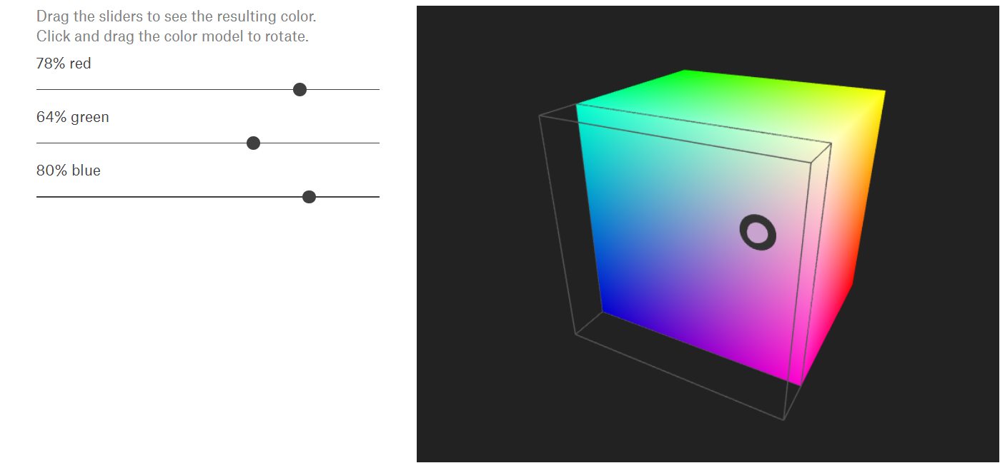
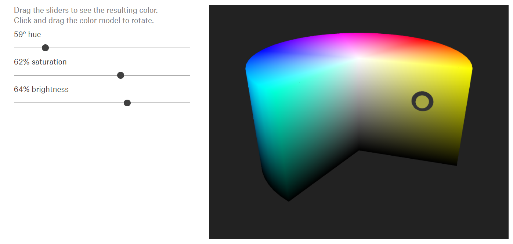

# Lecture3 Color
> https://thebookofshaders.com/06/

## 1. Define the Color
If you are familiar with object oriented programming paradigms you've probably noticed that we have been accessing the data inside the vectors like any regular C-like `struct`.

```glsl
vec3 red = vec3(1.0,0.0,0.0);
red.x = 1.0;
red.y = 0.0;
red.z = 0.0;
```
### Access through Different Names
Defining color using an x, y and z notation can be confusing and misleading. Therefore, there are other ways to access this same information, but with different names. 

```glsl
vec4 vector;
vector[0] = vector.r = vector.x = vector.s;
vector[1] = vector.g = vector.y = vector.t;
vector[2] = vector.b = vector.z = vector.p;
vector[3] = vector.a = vector.w = vector.q;
```

### Swizzle
The properties can be combined in any order you want, which makes it easy to cast and mix values.

```glsl
vec3 yellow, magenta, green;

// Making Yellow
yellow.rg = vec2(1.0);  // Assigning 1. to red and green channels
yellow[2] = 0.0;        // Assigning 0. to blue channel

// Making Magenta
magenta = yellow.rbg;   // Assign the channels with green and blue swapped

// Making Green
green.rgb = yellow.bgb; // Assign the blue channel of Yellow (0) to red and blue channels
```

## 2. Mixing Color

### Basic Mix
[mix()](https://registry.khronos.org/OpenGL-Refpages/gl4/html/mix.xhtml) function let you mix two values in percentages.

```glsl
#ifdef GL_ES
precision mediump float;
#endif

uniform vec2 u_resolution;
uniform float u_time;

vec3 colorA = vec3(0.149,0.141,0.912);
vec3 colorB = vec3(1.000,0.833,0.224);

void main() {
    vec3 color = vec3(0.0);

    float pct = abs(sin(u_time));

    // Mix uses pct (a value from 0-1) to
    // mix the two colors
    color = mix(colorA, colorB, pct);

    gl_FragColor = vec4(color,1.0);
}

```

### Channel Mix
The `mix()` function has more to offer. 

Instead of a single float, we can pass a variable type that matches the two first arguments, in our case a `vec3`. 

By doing that we gain control over the mixing percentages of each individual color channel, r, g and b.

```glsl
#ifdef GL_ES
precision mediump float;
#endif

#define PI 3.14159265359

uniform vec2 u_resolution;
uniform vec2 u_mouse;
uniform float u_time;

vec3 colorA = vec3(0.149,0.141,0.912);
vec3 colorB = vec3(1.000,0.833,0.224);

float plot (vec2 st, float pct){
  return  smoothstep( pct-0.01, pct, st.y) -
          smoothstep( pct, pct+0.01, st.y);
}

void main() {
    vec2 st = gl_FragCoord.xy/u_resolution.xy;
    vec3 color = vec3(0.0);

    vec3 pct = vec3(st.x);

    // pct.r = smoothstep(0.1,.8, st.x);
    // pct.g = sin(st.x*PI*.3);
    // pct.b = pow(st.x,0.2);

    color = mix(colorA, colorB, pct);

    // Plot transition lines for each channel
    color = mix(color,vec3(1.0,0.0,0.0),plot(st,pct.r));
    color = mix(color,vec3(0.0,1.0,0.0),plot(st,pct.g));
    color = mix(color,vec3(0.0,0.0,1.0),plot(st,pct.b));

    gl_FragColor = vec4(color,1.0);
}
```
- Uncomment line number 25 and watch what happens
- Then try uncommenting lines 26 and 27
- Remember that the lines visualize the amount of `colorA` and `colorB` to mix per channel.

## 3. Color Model

> https://programmingdesignsystems.com/color/color-models-and-color-spaces/index.html

A color model is a visualization that depicts the color spectrum as a multidimensional model

Most modern color models have **3 dimensions** (like RGB), and can therefore be depicted as 3D shapes

In the following, we will look at the **RGB**, **HSV**, and **HSL** color models

### RGB

**RGB** is a color model with three dimensions

- red
- green
- blue

The RGB color model is often depicted as a cube by mapping the red, green, and blue dimensions onto the x, y, and z axis in 3D space.



glsl use RGB as their color output.

### HSV/HSB

**HSV** is a cylindrical color model that remaps the RGB primary colors into dimensions that are easier for humans to understand. 

Like the Munsell Color System, these dimensions are 

- **Hue**
  - Hue specifies the angle of the color on the RGB color circle
    - 0° hue results in red
    - 120° results in green
    - 240° results in blue
- **Saturation**
  - Saturation controls the amount of color used
    - a color with 100% saturation will be the purest color possible
    - while 0% saturation yields grayscale.
- **Value/Brightness**
  - Value controls the brightness of the color
    - a color with 0% brightness is pure black
    - while a color with 100% brightness has no black mixed into the color

Because this dimension is often referred to as brightness, the HSV color model is sometimes called HSB, including in P5.js.



#### RGBtoHSB

Following script complete the conversion between RGB and HSB

- notice they are $\in [0.0, 1.0]^3$

```glsl
vec3 rgb2hsb( in vec3 c ){
    vec4 K = vec4(0.0, -1.0 / 3.0, 2.0 / 3.0, -1.0);
    vec4 p = mix(vec4(c.bg, K.wz),
                 vec4(c.gb, K.xy),
                 step(c.b, c.g));
    vec4 q = mix(vec4(p.xyw, c.r),
                 vec4(c.r, p.yzx),
                 step(p.x, c.r));
    float d = q.x - min(q.w, q.y);
    float e = 1.0e-10;
    return vec3(abs(q.z + (q.w - q.y) / (6.0 * d + e)),
                d / (q.x + e),
                q.x);
}

vec3 hsb2rgb( in vec3 c ){
    vec3 rgb = clamp(abs(mod(c.x*6.0+vec3(0.0,4.0,2.0),
                             6.0)-3.0)-1.0,
                     0.0,
                     1.0 );
    rgb = rgb*rgb*(3.0-2.0*rgb);
    return c.z * mix(vec3(1.0), rgb, c.y);
}
```

#### HSB in Polar Coordinates

HSB was originally designed to be represented in polar coordinates (based on the angle and radius) instead of cartesian coordinates (based on x and y). To map our HSB function to polar coordinates we need to obtain the angle and distance from the center of the billboard to the pixel coordinate. For that we will use the [`length()`](https://thebookofshaders.com/glossary/?search=length) function and [`atan(y,x)`](https://thebookofshaders.com/glossary/?search=atan) (which is the GLSL version of the commonly used `atan2(y,x)`).


To convert the Cartesian coordinate to the polar coordinate

```glsl
// Use polar coordinates instead of cartesian
float angle = atan(st.y,st.x)+u_time;
float radius = length(st)*2.0;
```

Once we obtain the angle and length we need to **normalize** their values to the range between $[0.0, 1.0]$

`atan(st.y, st.x)` will return an angle in radians between $[-\pi, \pi]$. So we need to divide this number by $2\pi$ (defined at the top of the code) to get values between $[-0.5, 0.5]$, which by simple addition we change to the desired range of $[0.0, 1.0]$

```glsl
#define TWO_PI 6.28318530718
// ...
float normalize_angle = angle/TWO_PI+0.5;
```

The whole script looks like:

```glsl
#ifdef GL_ES
precision mediump float;
#endif

#define TWO_PI 6.28318530718

uniform vec2 u_resolution;
uniform float u_time;

//  Function from Iñigo Quiles
//  https://www.shadertoy.com/view/MsS3Wc
vec3 hsb2rgb( in vec3 c ){
    vec3 rgb = clamp(abs(mod(c.x*6.0+vec3(0.0,4.0,2.0),
                             6.0)-3.0)-1.0,
                     0.0,
                     1.0 );
    rgb = rgb*rgb*(3.0-2.0*rgb);
    return c.z * mix( vec3(1.0), rgb, c.y);
}

void main(){
    vec2 st = gl_FragCoord.xy/u_resolution;
    vec3 color = vec3(0.0);

    // Use polar coordinates instead of cartesian
    vec2 toCenter = vec2(0.5)-st;
    float angle = atan(toCenter.y,toCenter.x);
    float radius = length(toCenter)*2.0;

    // Map the angle (-PI to PI) to the Hue (from 0 to 1)
    // and the Saturation to the radius
    color = hsb2rgb(vec3((angle/TWO_PI)+0.5,radius,1.0));

    gl_FragColor = vec4(color,1.0);
}
```


### HSL

**HSL** is another cylindrical color model that shares two dimensions with HSV, while replacing the value dimension with a lightness dimension.

- **Hue**
  - Hue specifies the angle of the color on the RGB color circle
    - 0° hue results in red
    - 120° results in green
    - 240° results in blue
- **Saturation**
  - Saturation controls the amount of color used
    - a color with 100% saturation will be the purest color possible
    - while 0% saturation yields grayscale.
- **Lightness**
  - Lightness controls the luminosity of the color. This dimension is different from the HSV value dimension in that the purest color is positioned midway between black and white ends of the scale.
    - a color with 0% lightness is black
    - 50% is the purest color possible
    - 100% is white


## 4. Easing Function

Robert Penner developed a series of popular shaping functions for computer animation known as [easing functions](https://easings.net/).

- For easing functions implemented by glsl, check: https://github.com/glslify/glsl-easings and http://glslify.github.io/glsl-easings/
- The following script are copied from this [link](https://thebookofshaders.com/edit.php#06/easing.frag). Replace the easing functions and test different effects

## 5. Addition

### Note about functions and arguments

Before jumping to the next chapter let’s stop and rewind. Go back and take look at the functions in previous examples. 

You will notice `in` before the type of the arguments. 

This is a [*qualifier*](http://www.shaderific.com/glsl-qualifiers/#inputqualifier) and in this case it specifies that the variable is read only.

In future examples we will see that it is also possible to define arguments as `out` or `inout`. This last one, `inout`, is conceptually similar to **passing an argument by reference** which will give us the possibility to **modify a passed variable**.

```glsl
int newFunction(in vec4 aVec4,      // read-only
                out vec3 aVec3,     // write-only
                inout int aInt);    // read-write
```
