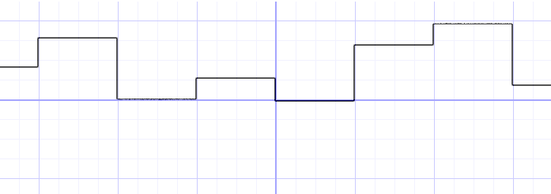
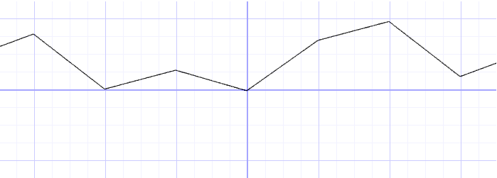
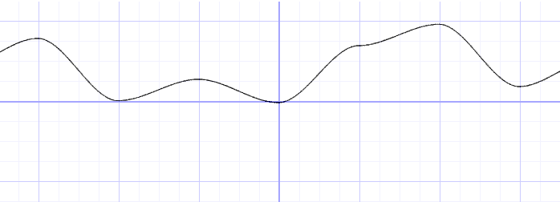
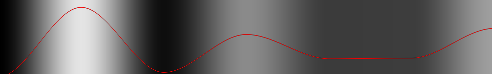
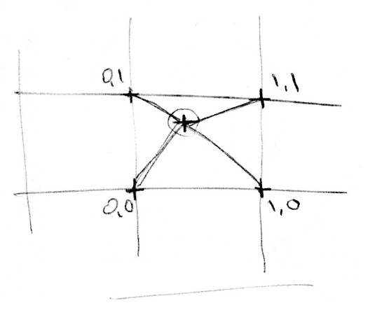
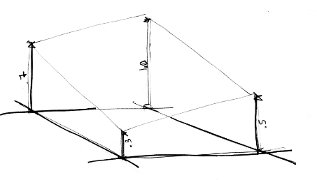
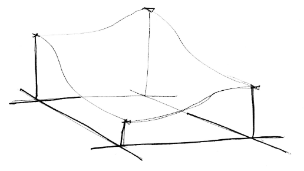

# Noise
> https://thebookofshaders.com/11/

## 1. Perlin Noise

### 1-D Noise Function

The following is not the classic Perlin noise algorithm, but it is a good starting point to understand how to generate noise.



```glsl
float i = floor(x);  // integer
float f = fract(x);  // fraction
y = rand(i); //rand() is described in the previous chapter
```

- We are subdividing a continuous floating number (`x`) into its integer (`i`) and fractional (`f`) components.
- We use [`floor()`](https://thebookofshaders.com/glossary/?search=floor) to obtain `i` and [`fract()`](https://thebookofshaders.com/glossary/?search=fract) to obtain `f`.
- Then we apply `rand()` to the integer part of `x`, which gives a unique random value for each integer.



```glsl
y = mix(rand(i), rand(i + 1.0), f);
```

- Interpolates each random value linearly.



```glsl
y = mix(rand(i), rand(i + 1.0), smoothstep(0.,1.,f));
```

- Use a [`smoothstep()`](https://thebookofshaders.com/glossary/?search=smoothstep) interpolation instead of a linear one

In some noise implementations you will find that programmers prefer to code their own cubic curves (like the following formula) instead of using the [`smoothstep()`](https://thebookofshaders.com/glossary/?search=smoothstep).

```glsl
float u = f * f * (3.0 - 2.0 * f ); // custom cubic curve
y = mix(rand(i), rand(i + 1.0), u); // using it in the interpolation
```

This *smooth randomness* is a game changer for graphical engineers or artists - it provides the ability to generate images and geometries with an organic feeling. Perlin's Noise Algorithm has been implemented over and over in different languages and dimensions to make mesmerizing pieces for all sorts of creative uses.

#### Scripts



```glsl
#ifdef GL_ES
precision mediump float;
#endif

uniform vec2 u_resolution;
uniform vec2 u_mouse;
uniform float u_time;

/*
uv: uv map
fun: function
output 1 to represent there this is in the range of the function, else output 0
*/
float plot_func(vec2 uv, float func) {
    // blur amount is relative to the resolution
    float blur = 2./u_resolution.y;    
    return  smoothstep( func-blur, func, uv.y) -
          smoothstep( func, func+blur, uv.y);
}

float random (vec2 st) {
    return fract(sin(dot(st.xy, vec2(12.9898,78.233)))* 99999.5453123);
}

float rand(float x){
    return random(vec2(x));
}

// x: range from [0, 1]
// samping point sample how much base on x
float noise(float x, float sample){
    x *= sample;
    float i = floor(x);  // integer (not sure why we need offset, some appears to have chaotics..)
    float f = fract(x);  // fraction    
    float func = rand(i); //rand() is described in the previous chapter
    func = mix(rand(i), rand(i + 1.0), smoothstep(0.,1.,f));
    return func;
}

void main() {
    // normalization
    vec2 uv = gl_FragCoord.xy/u_resolution;

    // my noise function impelmentation
    float func = noise(uv.x, 6.);

    float c_func = plot_func(uv, func);
    vec3 color_func = vec3(c_func) * vec3(1.0,0.0,0.0);

    // Plot y changed base on x
    vec3 color_bright = vec3(func);

    // here we mix the color_bright and color_func
    vec3 color = mix(color_bright, color_func, c_func);
    gl_FragColor = vec4(color,1.0);
}
```

### 2-D Noise Function

Now that we know how to do noise in 1D, it's time to move on to 2D



In 2D, instead of interpolating between two points of a line (`rand(x)` and `rand(x)+1.0`), we are going to interpolate between the four corners of the square area of a plane 

- `rand(st)`
- `rand(st)+vec2(1.,0.)`
- `rand(st)+vec2(0.,1.)`
- ``rand(st)+vec2(1.,1.)`



Similarly, if we want to obtain 3D noise we need to interpolate between the eight corners of a cube. 

This technique is all about interpolating random values, which is why it's called **value noise**.

Like the 1D example, this interpolation is not linear but cubic, which smoothly interpolates any points inside our square grid.


